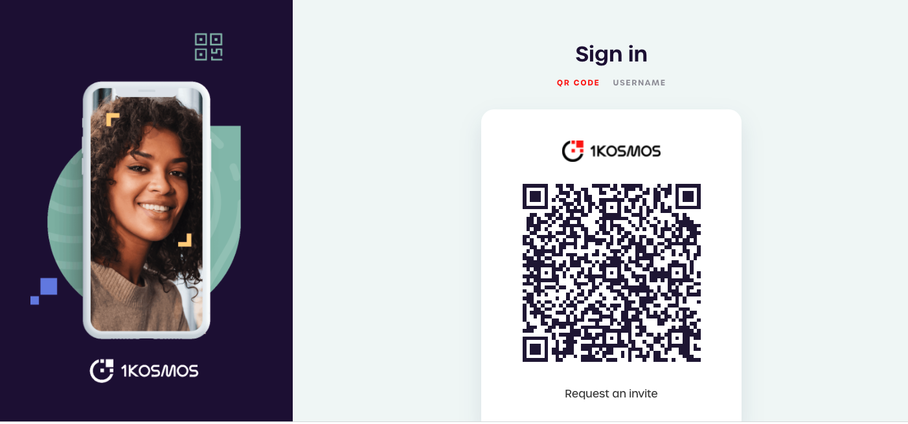
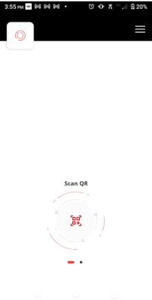

import Tabs from '@theme/Tabs';
import TabItem from '@theme/TabItem';

# Universal Web Login

## Overview


1Kosmos BlockID’s **Universal Web Login (UWL)** is a flexible authentication framework for web and mobile applications that ensures the highest level of assurance by reaching IAL3[^1] and AAL3[^2]levels per the [NIST 800-63-3](https://doi.org/10.6028/NIST.SP.800-63-3) guidelines. 

**UWL** augments or replaces the traditional username, password & MFA-based login with a passwordless experience by leveraging user biometrics with the BlockID mobile app. BlockID supports all true biometric options, including TouchID, FaceID, and LiveID.

:::info
### Before you Begin
Download and install the BlockID mobile application for your device: 

[BlockID for Android](https://play.google.com/store/apps/details?id=com.onekosmos.kernel.blockid)

 or 

[BlockID for iOS](https://apps.apple.com/us/app/blockid/id1539421428). 

Follow the on-screen instructions to register your application with the BlockID Platform and enroll your biometrics. Visit our [BlockID Mobile Application User Guide](https://1kosmos.document360.io/docs/blockid-mobile-application-user-guide#EnrollBio) for a step by step understanding of the enrollment process.
:::

## Quick Start Guide - Single Page Application (SPA)
This guide provides the steps to implement UWL authentication within the login page of your organization's SPA.

Before we begin, you will need some items from your **BlockID Developer Dashboard**:


We will need to copy our **API Key**, **Tenant Tag**, **Tenant URL**, and **Community Name** to our 
SDK index file, so keep the above information handy. 

:::caution
The following steps are written for the PHP-SDK version. The other SDKs will have a similar approach. Ensure you are hosting the PHP SDK on your infrastructure 
:::

## Setup
To get started, we need to delegate user authentication to the BlockID authentication service by adding a few lines of javascript to our page. We need to edit `blockid.js` and point it to our PHP SDK: 


<Tabs groupId="operating-systems">
  <TabItem value="php" label="PHP">  

```php title=src/blockid.php 
require_once('../blockid.php');
  $api = optional_param('confirm', 0, PARAM_BOOL);
}
```
</TabItem>
  <TabItem value="js" label="JavaScript" className="gray-text">
(Coming Soon)
</TabItem>
  <TabItem value="node" label="NodeJS" className="gray-text">
(Coming Soon)
</TabItem>
</Tabs>

This allows UWL to verify the user’s identity through the BlockID [mobile application](https://docs.1kosmos.com/docs/blockid-mobile-application-user-guide). After authentication, UWL  redirects back to your application or website. 

Next, we are going to edit the `index.php` file that we just defined as our API in `blockid.js`. Open `index.php` and provide the following API origin metadata that we copied from our **Developer Dashboard**:


<Tabs groupId="operating-systems">
 <TabItem value="php" label="PHP">

 ```php title=src/index.php 
 $tenantTag = "<customer_tag>";
 $tenantURL = "https://<customer_name>.1kosmos.in";
 $communityName = "default";
 ```
 </TabItem>
 <TabItem value="js" label="JavaScript" className="gray-text">
(Coming Soon)
 </TabItem>
 <TabItem value="node" label="NodeJS" className="gray-text">
(Coming Soon)
 </TabItem>
</Tabs>

##  Editing Your Existing Application

Next, we need to edit our current application to include `blockid.js`. To do so, add the following to the login page:
```html
<script type="text/javascript" src="./blockid.js">  </script>
```
We also need to add the following HTML content to our application. Under the `<head>` section of your page, add the following lines:

```html
 <script type="text/javascript">
 
     function createSession() {
             createNewSession("Fingerprint", "firstname,did,userIdList", "qrcode",null 
             , function(result, error) {client_dataRecieved(result)}
             )
     }

     function client_dataRecieved(result) {
         //logDebug("received decrypted data back: ", result,false)
         let str = JSON.stringify(result, null, 4)
         var obj = JSON.parse(str);
         let accountdata  = JSON.stringify(obj.account_data, null, 4);
         var oaccountdata = JSON.parse(accountdata);
         userID = oaccountdata.userIdList[0];
         alert(userID);
     }
 </script>
```

In the main body of your application, add the following line:
```html
<body onload="createSession();">
  ```
  
 Lastly, we need to generate our QR code by including the following line to where we want the code generated:
 ```html
 <div id="qrcode" style="z-index: 1;position:relative;margin:10px" align="center"> </div>
```


## Testing UWL Authentication
  
Once our Single Page Application (SPA) is configured for UWL, we can test its functionality by doing the following:

1. Navigate to your application's login page, which we edited to include UWL. A QR code will be displayed:


2. On your mobile device, open the BlockID Application and select **Scan QR**:



3. Scan the QR code with your mobile device. When prompted, click the **green checkmark** to authenticate. The device will ask you to authenticate the request with biometric verification. 


4. **That's it!** After successful authentication, you will be directed to the main page of your application. 

## Example BlockID Authentication Response   

When a user scans the QR code and authenticates on their mobile device, the BlockID SDK will deliver the following response payload: 

:::caution
This example contains dummy data
:::

```javascript
{
    "id": "6026464ebe66fd0e55c74144",
    "name": null,
    "sessionId": "wmstshk3h69c8xnsvv0etp",
    "publicKey": "jshbdhzfzsjipgjwoepSEGHoivAKBVLSDHVIGHANVdsjilSJdhsfbgAKJFHlajsFGSDJKFBJSDGFZESFODGJBVESJLJSFVKSAKF",
    "data": "FbdmgjldfkgbsnvlsldjfnvfjvbseofAFFiipwruofipewweuFfdiwepfuiwvdcbEjdpiaoufhuwioeadklhcfjbjdsDSkjfvhesoigvdjbjoifvhesufiwDFrsguhfsklfiorushfvbxkjigjslhidjxviodufjkxvbiseodufhvisfdepirouyfuosfidlxj",
    "did": "d789d8ys8d8gvb8sdyvb7tsf709sf877b67f6g98sf",
    "ial": "1",
    "appid": "com.onekosmos.kernel.blockid",
    "createdTS": 1613121102,
    "idTS": 1613121102,
       "user_data": {
        "userid": "anjali",
        "firstname": "Samsung Note",
        "did": "d789d8ys8d8gvb8sdyvb7tsf709sf877b67f6g98sf"
    },
"account_data": {
        "personId": "d789d8ys8d8gvb8sdyvb7tsf709sf877b67f6g98sf",
        "userIdList": [
            "anjali"
        ],
}
}
```
### Footnotes

[^1]:Physical presence is required for identity proofing. Identifying attributes must be verified by an authorized and trained representative of the CSP. As with IAL2, attributes can be asserted by CSPs to RPs in support of pseudonymous identity with verified attributes.

[^2]:AAL3: Provides very high confidence that the claimant controls authenticator(s) bound to the subscriber’s account. Authentication at AAL3 is based on proof of possession of a key through a cryptographic protocol. AAL3 authentication SHALL use a hardware-based authenticator and an authenticator that provides verifier impersonation resistance; the same device MAY fulfill both these requirements. In order to authenticate at AAL3, claimants SHALL prove possession and control of two distinct authentication factors through secure authentication protocol(s). Approved cryptographic techniques are required.
